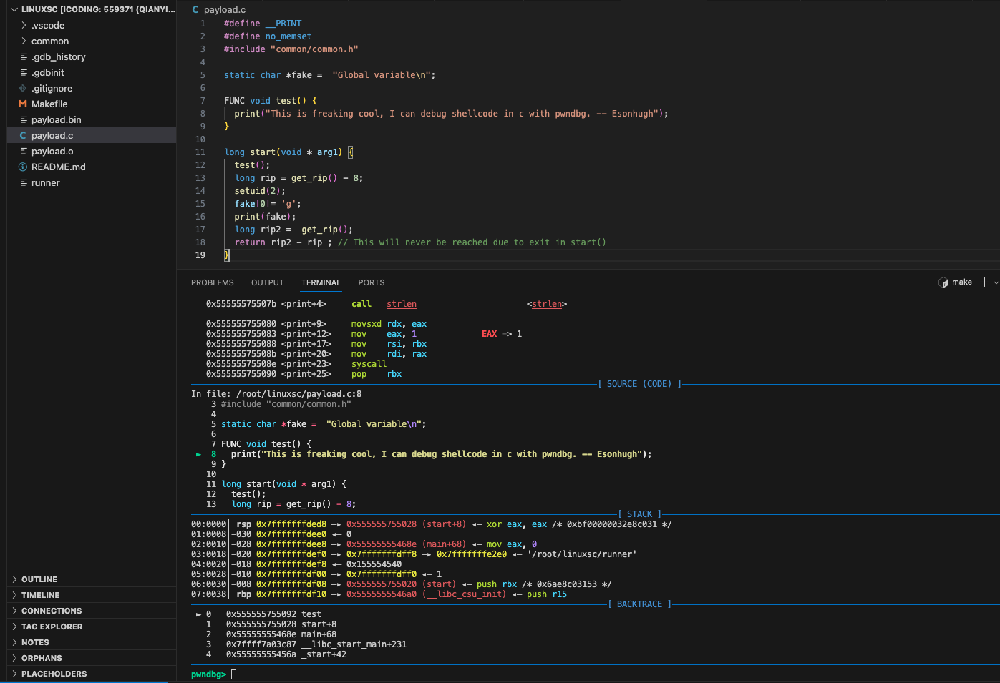

### Example shellcode development in linux x86_64

you can writing shellcode in c, and then compile it to shellcode directly.

and extra feature is debugging shellcode with gdb and c source code.

```bash
# writing shellcode in C
vim payload.c
```

```bash
# compile to shellcode
make
```

```bash
# run the shellcode
make run
```

```bash
# run with debugger
make debug
```

debug will launch pwndbg by default, so u can debug ur shellcode with your c source code like fallowing picture shows.


